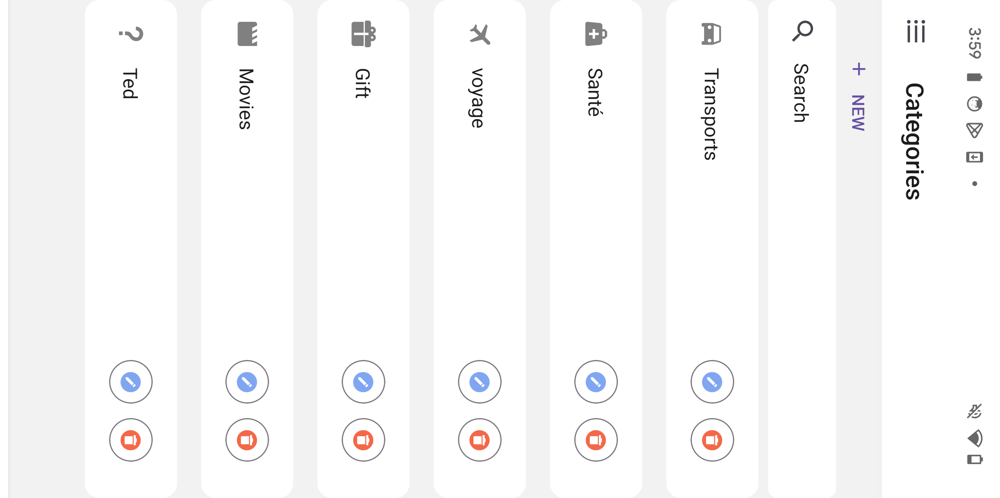

# Application Mobile d'Expense Tracker

Cette application permet aux utilisateurs de gérer et de catégoriser leurs dépenses, de numériser des reçus et de générer des rapports financiers détaillés. J'ai intégré une fonctionnalité d'intelligence artificielle pour l'enregistrement automatique des données, ce qui permet de minimiser les erreurs de saisie. La sécurité des données est garantie grâce à l'authentification OAuth 2.0.

## Onboarding de l'application

## Interfaces de connexion

  - Page d'inscription
  
  - Page de connexion
   
  - Gestion d'erreur
   
  - Page de réinitialisation du mot de passe
   
 

## Interfaces d'accueil

- Menu principal de l'application

- Page d'accueil après inscription ou connexion

## Interfaces de sécurité

- Choix du mode de connexion

- Vérification du email

- Interface de gestion du profil utilisateur

- Option de changement de langue

## Interfaces de gestion de comptes

- Liste des comptes

- Création de compte

## Interfaces de gestion des catégories

- Liste des catégories

- Création de catégories

## Interfaces de gestion des dépenses

- Liste des dépenses

- Tri des dépenses

- Description d’une dépense

- Formulaire de création de dépense

- Chargement ou photographie du reçu d'une dépense

- Selection de la periode de dépense pour le tableau de bord

- Tableau de bord des dépenses

- Sélection des dépenses pour exportation

- Exportation des dépenses

- Supprimer une dépense

